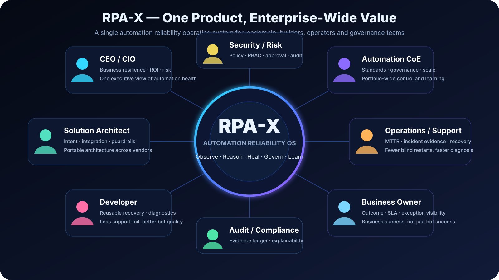
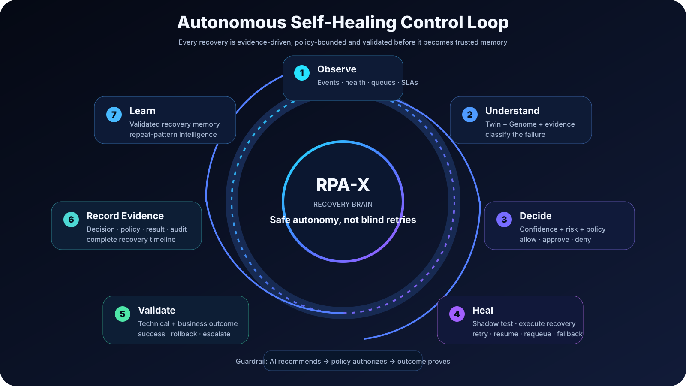
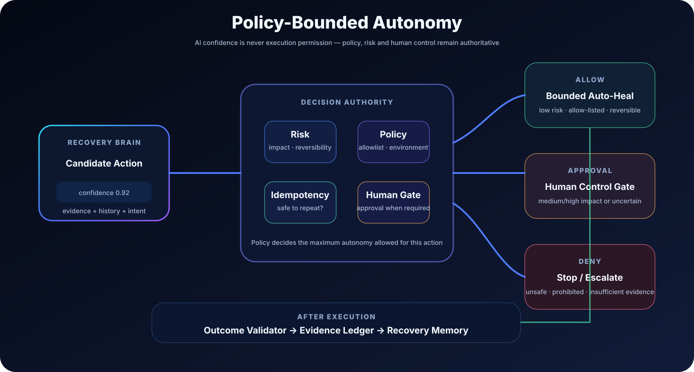
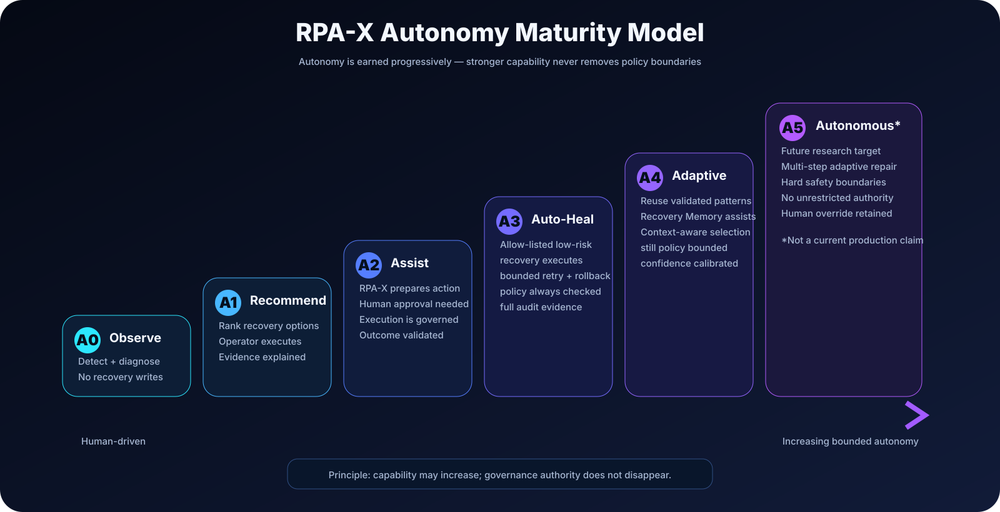
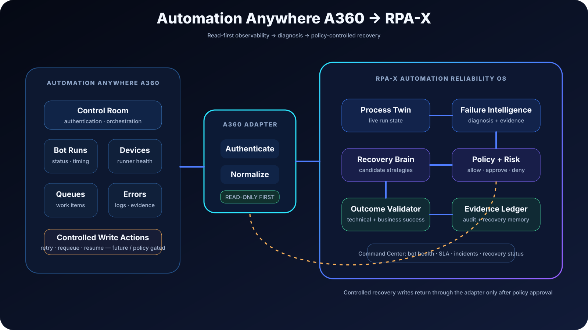
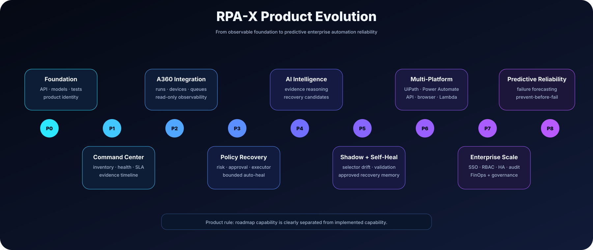

<p align="center">
  
</p>

<h3 align="center">The Autonomous Reliability & Intelligence Layer for Enterprise Automation</h3>
<p align="center"><strong>Observe · Understand · Decide · Heal · Govern · Learn</strong></p>

---

# RPA-X

**RPA-X** is being built as a single, vendor-neutral **Automation Reliability Operating System** for operating automations across RPA platforms, APIs, browsers, desktops, queues and serverless workloads.

It is not another bot designer. RPA-X sits **above automation runtimes** and gives the enterprise one intelligence, reliability, recovery, governance and learning control plane.

> **North-star:** move enterprise automation from **run → fail → ticket → investigate → fix → restart** to **run → observe → understand → recover → validate → learn** — without sacrificing human control, security or auditability.

## Executive product view

RPA-X is designed to create value for the complete automation organization — not only developers.

<p align="center">
  
</p>

The same product should give a CEO/CIO business resilience and automation value visibility, give the Automation CoE portfolio governance, give architects a vendor-neutral reliability layer, give developers reusable diagnostics, give operations faster MTTR, give business owners outcome visibility, and give security/audit teams hard policy and evidence.

## Why RPA-X exists

Production automation support is still highly reactive. A selector moves, an API slows down, a session expires, a queue item is corrupted, a VM becomes unhealthy, or an application changes. The bot fails, an incident is created, and a human reconstructs what happened.

RPA-X is designed to convert that fragmented support model into a unified reliability loop.

<p align="center">
  
</p>

## One product, one control plane

RPA-X is intentionally designed as **one coherent platform**, not separate utilities stitched together.

| Product capability | What it does |
|---|---|
| **Command Center** | One operational view of bots, processes, transactions, failures, SLAs and recovery status |
| **Process Genome Studio** | Defines automation intent, expected outcomes, dependencies, known exceptions and safe recovery strategies |
| **Live Process Twin** | Maintains a real-time model of where an automation is versus where it should be |
| **Failure Intelligence** | Diagnoses business, application, API, data, credential, infrastructure and unknown failures |
| **Recovery Brain** | Ranks recovery strategies using evidence, history, confidence and platform capabilities |
| **Shadow Lab** | Tests candidate recoveries before they are trusted in production |
| **Human Control Gate** | Routes medium/high-risk actions for approval instead of blindly executing them |
| **Evidence Ledger** | Records what happened, why a decision was made, what policy allowed it and whether it worked |
| **Recovery Memory** | Learns from validated recoveries and recognizes repeated failure patterns |
| **Integration Fabric** | Normalizes Automation Anywhere, UiPath, Power Automate, Selenium, APIs, queues and infrastructure |
| **Policy & Governance** | Controls autonomy levels, risk, RBAC, secrets, environment restrictions and auditability |
| **Automation FinOps** | Target capability for support cost, reliability, utilization and business value metrics |

See the full **[Product Blueprint](docs/PRODUCT_BLUEPRINT.md)**.

## Enterprise architecture

<p align="center">
  
</p>

RPA-X separates the system into five concerns: **automation runtimes, integration fabric, intelligence core, governance/safety, and execution assurance**. This lets new platforms connect through adapters without rebuilding the intelligence and governance model.

Detailed architecture: **[docs/ARCHITECTURE.md](docs/ARCHITECTURE.md)**

## The core innovation model

### 🧬 Process Genome

A versioned, machine-readable description of the automation's **intent**, not only its implementation. A Genome can describe business outcome and owner, process steps, expected outcomes, applications, APIs, selectors, data contracts, SLAs, known exceptions, recovery playbooks, risk classification and approvals.

### 🛰️ Live Process Twin

A runtime representation assembled from the Process Genome + current events + execution evidence. It answers where the run is now, what should happen next, which dependency changed, what evidence is available and whether recovery is still safe.

### 🧠 Failure Intelligence

Failure diagnosis is normalized across platforms rather than being tied to one bot vendor.

Target classes include:

`business` · `application` · `selector/UI drift` · `api` · `data` · `credential` · `infrastructure` · `queue` · `timeout` · `unknown`

### ⚡ Recovery Brain

The Recovery Brain does not simply retry everything. It evaluates evidence, previous outcomes, available adapter capabilities, idempotency, confidence, risk and policy.

Potential strategies include bounded retry, resume from checkpoint, requeue, session refresh, approved selector fallback, alternate API route, business-exception routing, circuit breaker, human approval and evidence-rich escalation.

## Policy-bounded autonomy

**AI confidence is not permission.** Recovery execution is constrained by hard policy, environment, risk, reversibility, idempotency and human approval rules.

<p align="center">
  
</p>

Read **[Security & Governance](docs/SECURITY_GOVERNANCE.md)** for the safety model.

## End-to-end self-healing workflow

The target recovery lifecycle is:

**Observe → Build live state → Detect anomaly → Gather evidence → Diagnose → Generate candidates → Score risk/confidence → Policy decision → Shadow validate → Execute → Validate outcome → Record evidence → Learn.**

The visual control loop above is the product-level workflow. More detailed selector, API, approval and exception flows are maintained in **[docs/WORKFLOWS.md](docs/WORKFLOWS.md)**.

## Product autonomy levels

RPA-X should earn autonomy gradually rather than jumping directly to uncontrolled agentic execution.

<p align="center">
  
</p>

| Level | Mode | Meaning |
|---|---|---|
| **A0** | Observe | Diagnose only; no recovery writes |
| **A1** | Recommend | Suggest recovery to operators |
| **A2** | Assist | Human approval required before execution |
| **A3** | Bounded Auto-Heal | Allow-listed low-risk recoveries may execute automatically |
| **A4** | Adaptive | Previously validated recovery patterns may be reused inside policy |
| **A5** | Autonomous | Future research target; still governed by hard policy boundaries |

## First enterprise target: Automation Anywhere A360

The first runtime integration is planned around Automation Anywhere A360. The integration begins **read-only**, proves observability and diagnosis, then introduces restricted write operations only through explicit policy.

<p align="center">
  
</p>

Target A360 data and capabilities include:

- Control Room authentication and capability discovery
- Bot run / deployment status
- Device and Bot Runner health
- Queue and work-item visibility
- Failure logs and evidence ingestion
- SLA / duration / retry visibility
- Policy-controlled retry, requeue or resume operations

## Example use case: UI selector drift

A bot expects a button, but the target application changes its DOM.

1. Runtime reports `selector not found`.
2. RPA-X captures failed-step and DOM/UI evidence.
3. The Process Twin compares expected versus observed state.
4. Failure Intelligence identifies UI drift.
5. Recovery Brain finds candidate elements and checks Recovery Memory.
6. Candidate actions are evaluated against risk and policy.
7. Safe candidates are tested in the Shadow Lab.
8. The technical and business outcome is validated.
9. Evidence is recorded.
10. Only a validated recovery may become trusted memory.

**Important:** the target design does not silently rewrite production bot source packages. Runtime recovery and permanent source changes are separate governed workflows.

## Example use case: API timeout

```text
API timeout
   ↓
Classify transient failure
   ↓
Verify operation is safe/idempotent
   ↓
Policy allows bounded retry
   ↓
Exponential backoff
   ↓
Validate response + downstream state
   ↓
Record evidence and recovery outcome
```

A technical retry should never be used for a genuine business exception.

## Command Center foundation preview

RPA-X includes a lightweight integrated **Command Center preview** served by the same FastAPI product. It reads the live `/health` and `/capabilities` APIs and presents product identity, control loop, autonomy model and the current capability registry.

This is intentionally a **foundation preview**, not yet a production monitoring dashboard. Real bot health, run history, SLA metrics and recovery evidence will be connected as persistence and platform adapters are built.

## What exists in the repository today

Current foundation includes:

- ✅ FastAPI service
- ✅ Unified product manifest and capability registry
- ✅ Integrated Command Center preview
- ✅ Runtime event model
- ✅ Failure classification foundation
- ✅ Recovery strategy foundation
- ✅ Live Process Twin foundation
- ✅ Evidence Ledger foundation
- ✅ Vendor-neutral adapter interface
- ✅ Sample Process Genome
- ✅ Unit tests
- ✅ GitHub Actions CI definition
- ✅ Executive product architecture and visual workflow pack
- ✅ RPA-X application icon and wordmark

The following are **planned**, not yet production-complete:

- 🚧 Persistent operational database
- 🚧 Automation Anywhere A360 Control Room adapter
- 🚧 Production Command Center telemetry and dashboards
- 🚧 Policy-as-code engine
- 🚧 Human approval service
- 🚧 Shadow execution environment
- 🚧 AI/LLM provider abstraction
- 🚧 Selector discovery and visual/DOM recovery
- 🚧 Multi-platform production adapters
- 🚧 Enterprise SSO/RBAC/secrets integration
- 🚧 Automation FinOps and predictive reliability

This distinction is intentional: RPA-X should never market roadmap concepts as production features.

## Visual product roadmap

<p align="center">
  
</p>

Detailed roadmap: **[docs/ROADMAP.md](docs/ROADMAP.md)**

## Repository structure

```text
RPA/
├── assets/
│   ├── rpa-x-app-icon.svg
│   ├── rpa-x-logo.svg
│   └── diagrams/
│       ├── 01-executive-value-map.svg
│       ├── 02-enterprise-architecture.svg
│       ├── 03-self-healing-lifecycle.svg
│       ├── 04-policy-autonomy-gate.svg
│       ├── 05-a360-integration-flow.svg
│       ├── 06-autonomy-levels.svg
│       └── 07-product-roadmap.svg
├── app/
│   ├── engine.py
│   ├── ledger.py
│   ├── main.py
│   ├── models.py
│   ├── product.py
│   └── twin.py
├── adapters/
│   └── base.py
├── genomes/
│   └── sample_invoice_process.yaml
├── docs/
│   ├── ARCHITECTURE.md
│   ├── PRODUCT_BLUEPRINT.md
│   ├── ROADMAP.md
│   ├── SECURITY_GOVERNANCE.md
│   └── WORKFLOWS.md
├── web/
│   ├── app.css
│   ├── app.js
│   ├── index.html
│   └── rpa-x-app-icon.svg
├── tests/
├── .github/workflows/
├── pyproject.toml
└── README.md
```

## Run the current product foundation

```bash
git clone https://github.com/logeshv586-code/RPA.git
cd RPA
python -m venv .venv
pip install -e .
uvicorn app.main:app --reload
```

Open the product surfaces:

```text
Command Center preview: http://127.0.0.1:8000/ui/
FastAPI documentation:  http://127.0.0.1:8000/docs
Product manifest:       http://127.0.0.1:8000/
Capability registry:    http://127.0.0.1:8000/capabilities
Health:                 http://127.0.0.1:8000/health
```

## Example runtime event

```json
{
  "process_id": "invoice-processing",
  "run_id": "run-2026-001",
  "step_id": "submit-invoice",
  "status": "failed",
  "message": "API timeout while calling vendor endpoint"
}
```

Send it to `POST /events`. The current engine can classify the event and select a basic recovery decision. Future versions will enrich that decision with process state, evidence, policy, history and outcome validation.

## Design principles

1. **One product experience** — monitoring, diagnosis, recovery, governance and learning belong in one control plane.
2. **Vendor neutral** — platform adapters translate runtimes into a common capability model.
3. **Read first** — new enterprise integrations start in observation mode.
4. **Intent before clicks** — reason from business outcome and expected state, not only selector errors.
5. **Policy before autonomy** — AI can recommend; policy authorizes.
6. **Evidence before confidence** — every recovery should be explainable.
7. **Validate the outcome** — technical success is not automatically business success.
8. **Unknown is acceptable** — RPA-X must never invent certainty to keep a process moving.
9. **Recovery must stop** — bounded retries and circuit breakers prevent runaway automation.
10. **Learn only from validated results** — failed or ambiguous repairs should not become trusted memory.

## Long-term vision

RPA-X should become an **Automation Reliability Operating System** for enterprises: one place to understand the health, intent, risk and recovery state of every important automation, regardless of which technology executes it.

The product is successful when automation teams spend less time restarting bots and reconstructing incidents — and more time improving business processes — while leadership, security and governance teams gain **more visibility and control, not less**.

## Project status

**Stage:** early foundation / architecture build.

The repository is public and evolving quickly. Production use is **not yet recommended**.

## License

A project license has not yet been selected. A license should be chosen before the first public release intended for external adoption or contribution.
