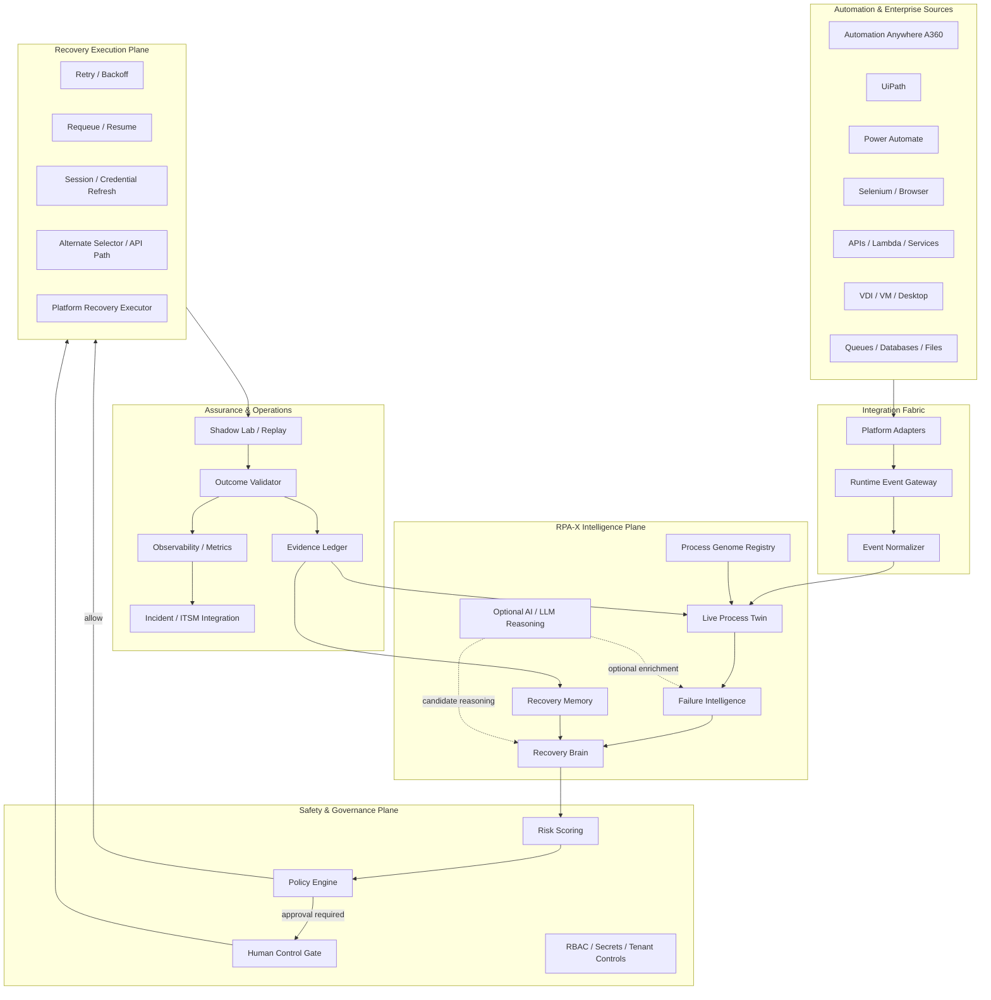
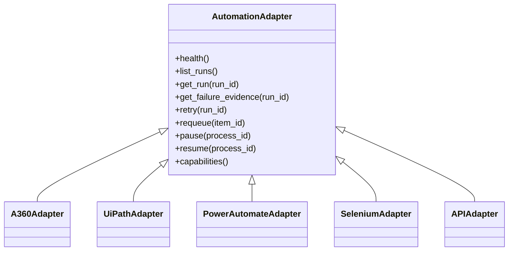
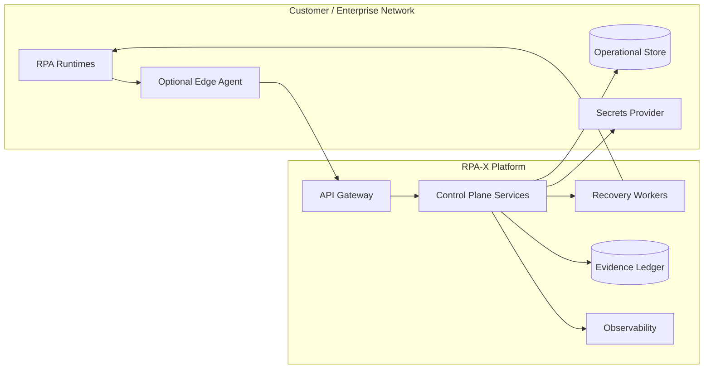

# RPA-X Architecture

## Architecture objective

RPA-X is a vendor-neutral control plane that receives telemetry from automation runtimes, reconstructs process state, evaluates failures, proposes or executes recovery, and records every decision for governance and learning.

## Logical architecture

## Separation of concerns

### Data plane
Carries events, bot execution telemetry, transaction state, queue status, screenshots/DOM references, API responses and runtime evidence.

### Intelligence plane
Determines what happened and what recovery candidates are available. It may use deterministic rules, historical patterns, ML models or LLMs.

### Policy plane
Determines what is allowed. This is deliberately independent from AI confidence.

### Execution plane
Performs only approved recovery actions through platform-specific adapters.

### Assurance plane
Validates outcomes, captures evidence, supports replay, and measures reliability.

## Core domain objects

### Process Genome
Versioned intent definition for an automation:

- Process identity and owner
- Business outcome
- Steps and expected outcomes
- Applications and APIs
- Selectors and alternate selectors
- Inputs / outputs / data contracts
- Idempotency characteristics
- SLAs and timing thresholds
- Known exceptions
- Approved recovery playbooks
- Risk classification
- Required approvals

### Runtime Event
Normalized observation emitted by a runtime or adapter.

### Process Twin
Current state representation built from Genome + events + evidence.

### Healing Decision
A proposed recovery containing failure type, action, confidence, expected impact, risk, policy result and approval requirement.

### Evidence Record
Append-only event describing input evidence, decision logic, policy evaluation, executor action and outcome.

## Multi-platform adapter contract

Every adapter should expose a common capability vocabulary rather than leaking vendor-specific APIs into the intelligence layer.

Adapters must advertise supported operations so the Recovery Brain cannot request a capability that a runtime does not safely expose.

## Recovery contract

Every recovery action should answer:

1. **What failed?**
2. **What evidence proves it?**
3. **What action is proposed?**
4. **Is the action idempotent?**
5. **What is the blast radius?**
6. **What policy permits it?**
7. **How will success be validated?**
8. **How will it be rolled back or stopped?**

## Deployment model

RPA-X should support both a central service model and enterprise-hosted deployment. Credentials should remain in approved secret stores and never be embedded in Process Genomes.

## Architectural guardrails

- Default to read-only integration first.
- Prefer idempotent recovery actions.
- Separate diagnosis from authorization.
- Keep AI providers replaceable.
- Never make secrets part of prompts or audit logs.
- Make every autonomous action traceable to policy.
- Require outcome validation after any recovery.
- Preserve platform-specific evidence while normalizing metadata.
- Design for replay and deterministic testing.
- Treat unknown failures as a valid class, not a reason to guess.
