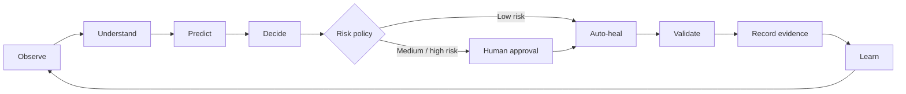

# RPA-X Product Blueprint

## Product thesis

RPA-X is designed as **one enterprise automation reliability product**, not a collection of disconnected utilities.

The product sits above existing automation runtimes and turns them into a governed autonomous operations layer. It does not replace Automation Anywhere, UiPath, Power Automate, Selenium, APIs, or serverless automation. It observes them, understands their intent, coordinates recovery, and provides one operational view across the automation estate.

## Product promise

**One place to know what every automation is doing, why it failed, what RPA-X recommends, what it repaired, and whether the recovery is safe.**

## Unified product surface

| Product capability | Purpose | Experience |
|---|---|---|
| **Command Center** | Portfolio health, SLA, failures, recoveries, queues and runtime status | Executive + operations dashboard |
| **Process Genome Studio** | Define automation intent, steps, dependencies, outcomes and approved recovery strategies | Designer / configuration experience |
| **Live Process Twin** | Maintain a runtime model of the automation state and expected next state | Real-time execution view |
| **Failure Intelligence** | Classify business, UI, API, data, credential, infrastructure and unknown failures | AI-assisted diagnosis |
| **Recovery Brain** | Rank safe recovery strategies and execute bounded actions | Autonomous operations engine |
| **Shadow Lab** | Validate candidate fixes before production use | Simulation and replay environment |
| **Human Control Gate** | Route medium/high-risk actions for approval | Approval inbox and escalation |
| **Evidence Ledger** | Record evidence, decisions, confidence, policy checks and outcomes | Audit and explainability timeline |
| **Integration Fabric** | Connect RPA platforms, APIs, queues, databases, browsers, VMs and incident tools | Adapter framework |
| **Policy & Governance** | Define autonomy levels, risk boundaries, RBAC, secrets and compliance rules | Enterprise governance center |
| **Learning Memory** | Reuse successful recoveries and detect repeated failure patterns | Recovery memory and recommendations |
| **Automation FinOps** | Track bot utilization, failure cost, manual effort avoided and recovery ROI | Value realization dashboard |

## The product operating loop

## Product personas

### Automation Operations
Needs a single control room for failures, bot health, queues, recoveries and incidents.

### RPA Developer
Needs reproducible failures, evidence, safe selector/API recovery and faster debugging.

### Solution Architect
Needs platform-agnostic orchestration, policy, resilience design and integration patterns.

### Business Owner
Needs SLA status, impact, exceptions, throughput and business outcome visibility.

### Risk / Audit / Security
Needs explainable decisions, approval history, immutable evidence, access controls and policy traceability.

### Executive Sponsor / CoE Leader
Needs estate health, automation value, reliability, risk exposure, MTTR, recovery rate and platform adoption.

## Autonomy model

RPA-X should never equate AI confidence with permission. Every proposed recovery is evaluated by a policy layer.

| Level | Mode | Example |
|---|---|---|
| **A0 Observe** | No change allowed | Detect and diagnose only |
| **A1 Recommend** | Suggest action | Recommend session refresh |
| **A2 Assist** | Human approves each action | Requeue failed transaction after review |
| **A3 Bounded Auto-Heal** | Auto-execute allow-listed low-risk actions | Retry idempotent API with backoff |
| **A4 Adaptive** | Use learned approved strategies within strict policy | Apply previously validated selector fallback |
| **A5 Autonomous** | Future research target, still policy constrained | Multi-step recovery planning with continuous validation |

## Differentiation

RPA-X is intended to combine four ideas into one product model:

1. **Intent-aware automation** through the Process Genome.
2. **Runtime state awareness** through the Live Process Twin.
3. **Bounded self-healing** through policy-controlled recovery.
4. **Audit-grade learning** through the Evidence Ledger and Recovery Memory.

The product should favor deterministic evidence and policy before generative reasoning. AI can propose and rank; policy controls what may execute.

## Success metrics

The platform should eventually measure:

- Mean time to detect (MTTD)
- Mean time to diagnose (MTTDx)
- Mean time to recover (MTTR)
- Autonomous recovery rate
- Human approval rate
- Repeat-failure reduction
- SLA breach avoidance
- Transaction recovery success
- False recovery / rollback rate
- Bot utilization
- Manual support hours avoided
- Estimated business value protected

## Product principle

> RPA-X is not an AI chatbot attached to RPA. It is a reliability and governance control plane where AI is one decision-support component inside a policy-bounded operating system for automation.
