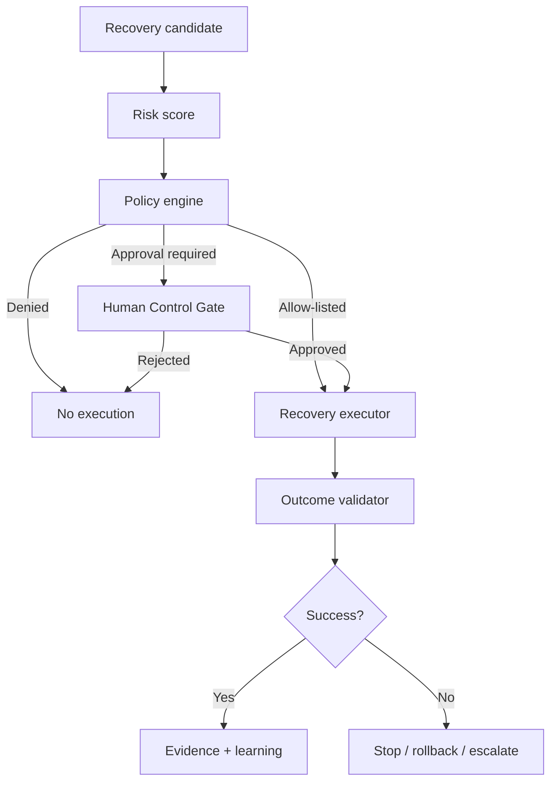

# RPA-X Security & Governance

RPA-X is intended to influence production automations, so safety and governance are product capabilities, not deployment afterthoughts.

## Safety model

The system separates four independent questions:

1. **Diagnosis:** what probably happened?
2. **Confidence:** how strong is the evidence?
3. **Authorization:** is RPA-X permitted to perform the proposed action?
4. **Validation:** did the action produce the expected business and technical outcome?

An AI model may contribute to diagnosis and ranking, but it must not grant itself permission to act.

## Risk categories

| Risk | Typical action | Default posture |
|---|---|---|
| **Low** | Idempotent retry with bounded backoff | Can be eligible for A3 auto-heal |
| **Medium** | Requeue transaction, refresh session, alternate selector | Approval until explicitly allow-listed |
| **High** | Update production data, alter source automation, change credentials | Human approval required |
| **Critical** | Financial posting reversal, privileged access change, mass transaction action | Outside autonomous scope by default |

## Core controls

### Identity and access

- SSO / OIDC target architecture
- Role-based access control
- Least-privilege platform service accounts
- Separate read and recovery permissions
- Approval-role separation where required
- Tenant / business-unit scoping

### Secrets

- No passwords, tokens or private keys in Process Genomes
- Integrate with enterprise secret managers
- Redact credentials from logs, evidence and AI prompts
- Rotate service credentials independently of automation definitions

### Recovery policy

- Explicit allow-list of autonomous actions
- Risk score and blast-radius checks
- Idempotency requirement where applicable
- Transaction limits
- Time-window controls
- Environment controls: dev / test / UAT / production
- Circuit breakers for repeated unsuccessful recoveries

### Evidence

Every recovery should capture:

- Correlation / run ID
- Process and step
- Failure evidence
- Failure classification
- Candidate actions considered
- Selected action
- Confidence
- Risk rating
- Policy evaluation
- Approver and approval comment, when applicable
- Executor result
- Outcome validation
- Rollback / escalation result
- Timestamped trace

## Human Control Gate

## AI governance

- AI reasoning must be optional and provider-neutral.
- Sensitive evidence should be minimized before model calls.
- Prompt templates and model versions should be recorded for auditable decisions where permitted.
- Generated actions must map to a finite recovery capability registry.
- Free-form generated code must not execute directly in production.
- Model output must be validated against schema and policy.
- Low confidence should increase human involvement, not increase exploration in production.

## Production safety principles

1. **Read first, write later.** New platform adapters begin in observation mode.
2. **Bound the blast radius.** One transaction before many; one bot before a fleet.
3. **Validate business outcomes.** HTTP 200 or a successful click is not enough.
4. **Stop after repeated failure.** Recovery loops must have circuit breakers.
5. **Preserve evidence.** A recovery without a trace is a governance failure.
6. **Do not silently change source packages.** Runtime fallback and permanent change promotion should be separate.
7. **Prefer reversible actions.** Recovery design should include rollback or escalation paths.
8. **Treat unknown as unknown.** The product should never fabricate certainty to keep automation moving.

## Audit questions RPA-X should always be able to answer

- What automation was affected?
- What happened?
- What evidence was available at the time?
- Why was this action selected?
- Which policy allowed it?
- Who approved it, if required?
- What changed in the target system?
- How was success verified?
- Was the same recovery used previously?
- What should prevent recurrence?
