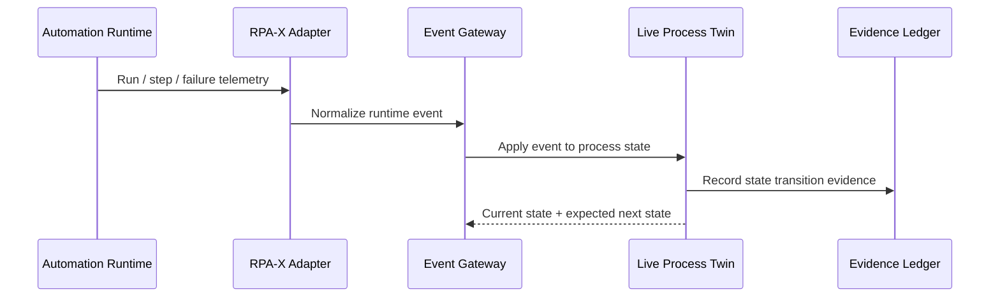
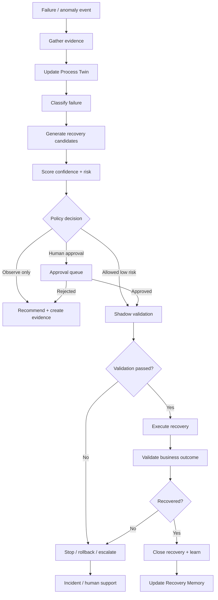
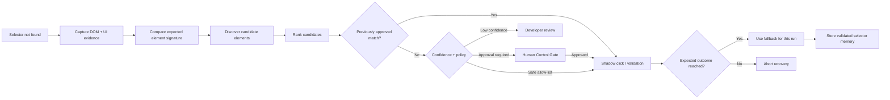
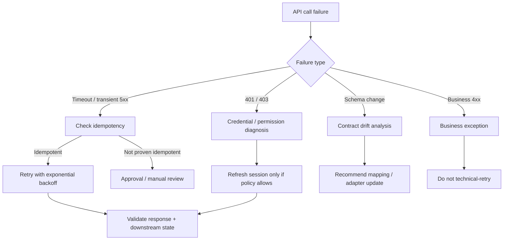
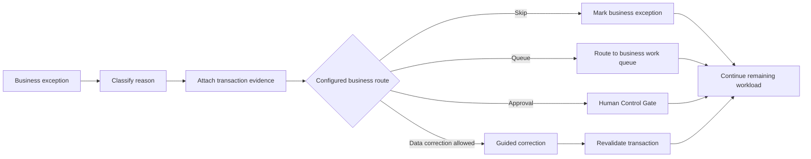
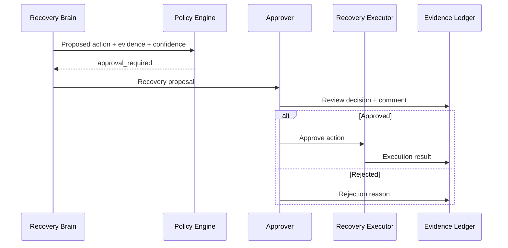
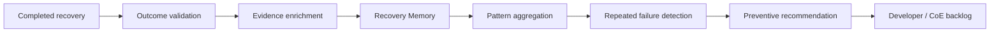
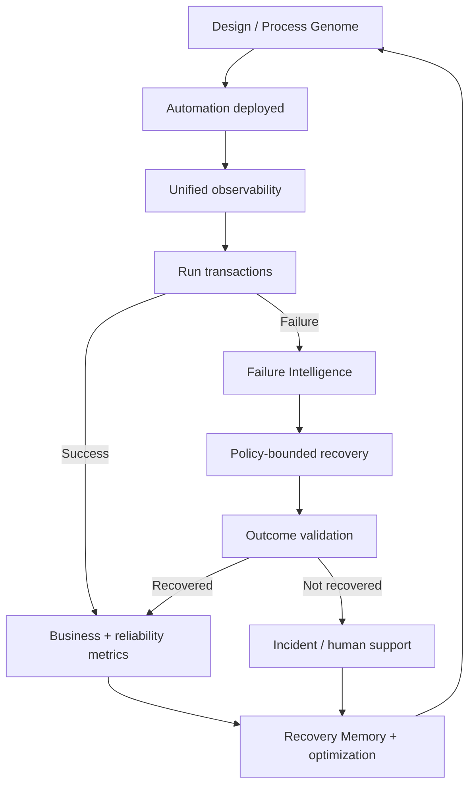

# RPA-X Workflows

This document defines the target operating workflows for RPA-X as a single enterprise product.

## 1. Runtime observation workflow

## 2. Failure-to-recovery workflow

## 3. Selector self-healing workflow

The target design does **not** silently rewrite source automation packages. Initial self-healing should be runtime-scoped. Permanent changes should be proposed through governed promotion workflows.

## 4. API failure workflow

## 5. Business exception workflow

## 6. Human approval workflow

## 7. Learning workflow

RPA-X should learn from **validated outcomes**, not merely from actions that executed without throwing an error.

## 8. End-to-end enterprise workflow

